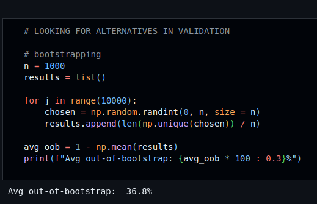

<h1> Machine Learning Book Practice - Python Project</h1>
 
<h2>Features</h2>
<ul>
    <li>Part 2: Preparing Your Learning Tools
        <ul>
                    <li>Chapter 4: Installing a Python Distribution</li>
                    <li>Chapter 5: Beyond Basic Coding in Python</li>
        </ul>
    </li>
     
    <li>Part 3: Getting Started with the Math Basics
        <ul>
                    <li>Chapter 6: Demystifying the Math Behind Machine Learning</li>
                    <li>Chapter 9: Validating Machine Learning</li>
                    <li> Chapter 10: Starting with Simple Learners</li>
        </ul>
    </li>
    <li>Part 4: Learning from Smart and Big Data
        <ul>
                    <li>Chapter 11: Preprocessing Data</li>
        </ul>
    </li>
</ul>

<h2>Acknowledgments</h2>

<b> Python3: http://bit.ly/python3-certifications <b>
 

<h2>Book</h2>
<b> Auhtors: John Paul Mueller & Luca Massaron <b>
 
<b> Read the book: https://bit.ly/machine-learning-for-dummies <b>
 

<h2>Photo</h2>

 

<h2>Contact</h2>

<b> Email: mariusc0023@gmail.com </b>
